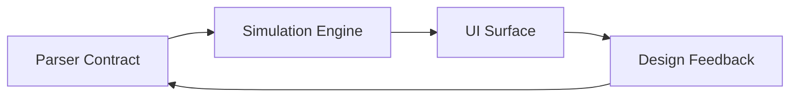

# Current Status

Backlinks: [[MonteRun MOC]] · [[Daily Notes/2026-04-12]] · [[03-Resources/Architecture/Parser-and-Simulation-Flow]] · [[03-Resources/Simulations/Monte-Carlo-Engine]] · [[03-Resources/Design/emil-design-eng]]

## Project Snapshot
- Backend parse contract understands delayed income through `income_delay_months`.
- Parser launch-hardening is current: DeepSeek extracts compact JSON, emits no reasoning output, and simulation math remains in code with a sub-10-second extraction target.
- Monte Carlo logic keeps separate income and burn noise paths and honors an absorbing zero barrier.
- UI moved from terminal-heavy framing toward a softer glass analytics surface while preserving raw spaghetti trajectories and quantile overlays.
- Delta Share Card is live: baseline/latest state is stored locally, encoded into share URL params, rendered on `/share`, and exposed through `/api/og`.
- Telegram Drift Alerts are live: `/start` stores `user_alerts`, the protected cron route checks 7-day drift candidates, and Telegram `sendMessage` sends the check-in.
- Obsidian uses PARA, Daily Notes, Templates and commit traces instead of loose markdown drift.

## Current Focus
- Keep parse/schema/simulation links synced across backend and frontend without letting the LLM own math.
- Track design debt inside Linear and mirror strategic context here through linked notes.
- Grow the vault through daily logging and commit traces instead of ad-hoc notes.

## System Loop

## Related Notes
- Project hub: [[MonteRun MOC]]
- Daily rhythm: [[Daily Notes/2026-04-12]]
- Architecture chain: [[03-Resources/Architecture/Parser-and-Simulation-Flow]]
- Simulation model: [[03-Resources/Simulations/Monte-Carlo-Engine]]
- Design principles: [[03-Resources/Design/emil-design-eng]]
- Knowledge ops: [[02-Areas/Knowledge-Operations]]
- Auto logging: [[03-Resources/Automation/Obsidian-AutoLogger]]
