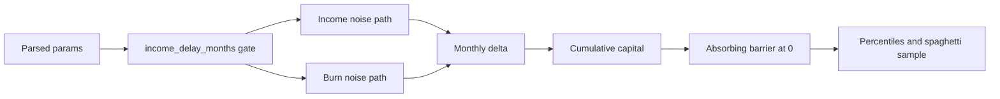

# Monte-Carlo-Engine

Backlinks: [[ForkVerse MOC]] · [[01-Projects/ForkVerse/Current-Status]] · [[03-Resources/Architecture/Parser-and-Simulation-Flow]] · [[03-Resources/MOC]]

## Purpose
Эта заметка фиксирует, как ForkVerse считает runway после парсинга сценария.

## Key Behaviors
- `income_delay_months` обнуляет monthly income на первых N месяцах.
- Доход и burn получают отдельный multiplicative noise.
- После первого `capital <= 0` траектория замораживается на нуле.
- На выходе формируются percentiles и `spaghetti_sample` для графика.

## Simulation Flow

## Connected Context
- Project overview: [[ForkVerse MOC]]
- Current state: [[01-Projects/ForkVerse/Current-Status]]
- API contract path: [[03-Resources/Architecture/Parser-and-Simulation-Flow]]
- Design context: [[03-Resources/Design/emil-design-eng]]
