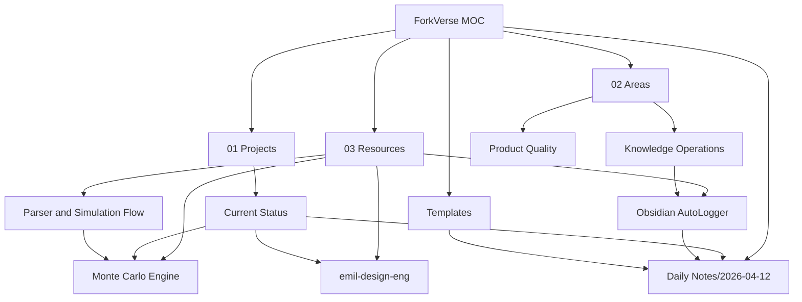

# ForkVerse MOC

> Главный вход в Second Brain проекта ForkVerse. Эта заметка связывает Projects, Areas, Resources, Daily Notes, Templates и архивный след в одну навигационную карту.

## PARA Hub
- Projects: [[01-Projects/ForkVerse/Current-Status]]
- Areas: [[02-Areas/MOC]]
- Resources: [[03-Resources/MOC]]
- Archives: [[04-Archives/MOC]]
- Daily cadence: [[Daily Notes/2026-04-12]]
- Templates: [[Templates/MOC]]

## Today
- Daily note: [[Daily Notes/2026-04-12]]
- Inbox bootstrap: [[00-Inbox/2026-04-12 Obsidian Bootstrap]]
- Latest knowledge log: [[00-Inbox/Git Log/2026-04-12/120000-second-brain-setup]]

## Project Map
- Active status: [[01-Projects/ForkVerse/Current-Status]]
- Architecture chain: [[03-Resources/Architecture/Parser-and-Simulation-Flow]]
- Simulation model: [[03-Resources/Simulations/Monte-Carlo-Engine]]
- Design bar: [[03-Resources/Design/emil-design-eng]]
- Auto-logging rule: [[03-Resources/Automation/Obsidian-AutoLogger]]

## Graph View Seed

## Operating Rules
- Каждое изменение оставляет след через [[Daily Notes/2026-04-12]] или будущие daily notes и отдельную связанную заметку.
- Новые backend-решения идут в [[03-Resources/Architecture/Parser-and-Simulation-Flow]] или отдельный architecture decision note.
- Новые math/model изменения идут в [[03-Resources/Simulations/Monte-Carlo-Engine]].
- Новые UI/UX решения идут в [[03-Resources/Design/emil-design-eng]].
- Commit-level trace поддерживается через [[03-Resources/Automation/Obsidian-AutoLogger]].
