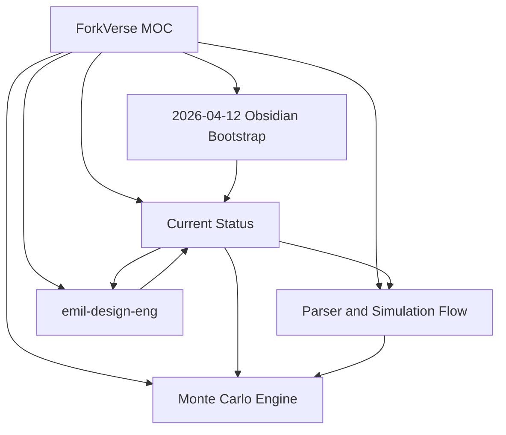

# ForkVerse MOC

> Главная карта знаний проекта ForkVerse. Эта заметка — входная точка для Graph View, навигации и быстрого обзора контекста.

## Core Navigation
- [[01-Projects/ForkVerse/Current-Status]]
- [[02-Architecture/Parser-and-Simulation-Flow]]
- [[03-Simulations/Monte-Carlo-Engine]]
- [[04-Design/emil-design-eng]]
- [[00-Inbox/2026-04-12 Obsidian Bootstrap]]

## Active Threads
- Доход с задержкой и его влияние на runway: [[03-Simulations/Monte-Carlo-Engine]]
- Контракт parse -> simulation -> chart: [[02-Architecture/Parser-and-Simulation-Flow]]
- UI polishing по принципам emil-design-eng: [[04-Design/emil-design-eng]]
- Последний оперативный след в базе знаний: [[00-Inbox/2026-04-12 Obsidian Bootstrap]]

## Maps of Content
- Project state: [[01-Projects/ForkVerse/Current-Status]]
- Simulation logic: [[03-Simulations/Monte-Carlo-Engine]]
- Design system direction: [[04-Design/emil-design-eng]]

## Graph View Seed

## Working Notes
- Любая новая доработка должна оставлять след через связанную заметку, а не через изолированный changelog.
- Если меняется backend-схема, обновляем [[02-Architecture/Parser-and-Simulation-Flow]] и [[03-Simulations/Monte-Carlo-Engine]].
- Если меняется визуальный слой продукта, обновляем [[04-Design/emil-design-eng]] и [[01-Projects/ForkVerse/Current-Status]].
